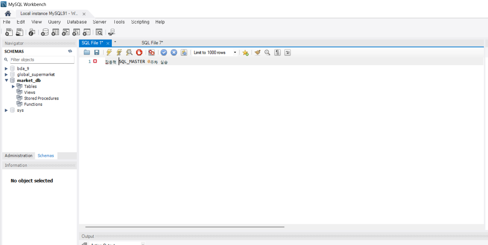

# SQL_MASTER 1주차 정규 과제 

## Week 1 : 데이터베이스와 SQL 

📌**SQL_MASTER 정규과제**는 매주 MySQL Workbench 툴을 활용하여 **직접 데이터베이스를 설계하고 실습하는 프로젝트 기반 과제**로  『*혼자 공부하는 SQL*』 책을 읽으며 학습을 진행해주시면 됩니다. 

<!-- 교재는 Notion - 자료실에서 다운받으실 수 있습니다. -->

이번 주는 아래의 **SQL_MASTER_1st_TIL**에 나열된 주제를 중심으로 개념을 학습하고, 주차별 **학습 목표**에 맞게 정리해주세요. 정리한 내용은 GitHub에 업로드한 후, **스프레드시트의 'SQL' 시트에 링크를 제출**해주세요. 

> ✅ **과제 제출 시 반드시 “Workbench 실습 화면 (캡처)” 를 첨부해주세요!**
>
> - 테이블 생성, 수정, 삭제 명령이 실행된 화면 또는 결과가 확인되는 캡처를 첨부합니다.
> - Github에 정리하는 실습 TIL 링크를 **스프레드시트 'SQL_MASTER' 시트에 제출**해주세요.

## SQL_MASTER_1st_TIL

## 1장. 데이터베이스와 SQL

### 01. 데이터베이스 알아보기

### 02. MySQL 설치하기

## 🏁 주차별 학습 (Study Schedule)

| 주차  | 공부 범위                  | 완료 여부 |
| ----- | -------------------------- | --------- |
| 1주차 | **데이터베이스와 SQL**     | ✅         |
| 2주차 | **실전용 SQL 미리 맛보기** | 🍽️         |
| 3주차 | **기본, 고급 DML 복습**    | 🍽️         |
| 4주차 | **테이블과 뷰**            | 🍽️         |
| 5주차 | **인덱스**                 | 🍽️         |
| 6주차 | **스토어드 프로시져**      | 🍽️         |
| 7주차 | **마지막 실습**            | 🍽️         |

 

<!-- 여기까진 그대로 둬 주세요-->

---

# 1️⃣ 개념정리

## 01. 데이터베이스 알아보기

~~~
✅ 학습 목표 :
* 데이터베이스와 DBMS의 개념 및 필요성을 이해한다.
* 계층형 DBMS, 망형 DBMS, 관계형 DBMS의 차이에 대해 알 수 있다.
* SQL에 필요한 소프트웨어, MySQL이 무엇인지 알고 설치할 수 있다. 
~~~

### (1) 데이터베이스(Database)

**정의**
- 데이터의 집합 (데이터를 체계적으로 모아 관리하는 저장소)
- 여러 사람이 공유하고 동시에 사용할 수 있는 데이터 저장 공간

**일상 속 예시**

- 카카오톡 메시지

- 인스타그램 사진

- 교통카드 승하차 기록

- 카페 결제 내역

**특징**

- 많은 사용자가 동시에 접근·공유 가능 (단 DBMS 필요)

### (2) DBMS의 정의

**DBMS(Database Management System)**

데이터베이스를 효율적으로 구축·운영·관리하는 소프트웨어

- 예: MySQL, Oracle, SQL Server, MariaDB

**필요 이유**

- 단순 파일 관리의 문제점(중복, 불일치, 동시 접근 불가)을 해결

- 여러 사용자/응용프로그램이 동시에 접근 가능

- 데이터 보안, 무결성(정확성), 일관성 유지

### (3) 발전 과정

1. 종이에 기록

2. 구멍가게 판매·구매 내역을 수기로 기록

- 장점: 단순, 즉시 기록 가능

- 단점: 분실 위험, 데이터 공유 불가

3. 컴퓨터 파일 관리

4. 엑셀, 메모장 등으로 데이터 기록/저장

- 장점: 편리, 자동 계산 가능

- 단점:

    동시 접근 불가 (한 번에 한 사람만 사용 가능)

    데이터 불일치 발생 가능 (중복, 누락, 충돌)

**5. DBMS의 등장**

파일 관리의 한계 극복

1973년 E.F. Codd가 관계형 데이터베이스 이론 정립

현재 대규모 데이터 관리에 필수적

-> DBMS는 대규모 데이터를 안정적으로 저장·공유·관리하기 위한 핵심 시스템

### 2. DBMS의 유형

#### (1) 계층형 DBMS (Hierarchical)

1960년대 등장, 트리(Tree) 구조

예: “사장 → 이사 → 팀” 구조

**특징**

- 상위-하위가 1:N 관계

- 데이터 접근이 비효율적 (여러 단계를 거쳐야 함)

- 구조 변경이 매우 어려움

- 현재는 거의 사용하지 않음

#### (2) 망형 DBMS (Network)

1970년대 등장, 그래프 구조

**특징**

- 하위 데이터끼리도 직접 연결 가능 (유연성↑)

- 예: 재무팀 ↔ 회계팀 간 직접 연결

- 단점: 프로그래머가 전체 구조를 정확히 알아야만 활용 가능

- 현재는 드물게 사용

#### (3) 관계형 DBMS (Relational, RDBMS)

- 현재 가장 널리 사용

- 데이터는 테이블(Table) 단위로 저장

- 테이블 = 행(Row, 튜플) + 열(Column, 속성)

**특징**

- 단순하고 이해 쉬움 (2차원 표 구조)

- SQL 언어를 이용해 조작 가능 (검색, 삽입, 수정, 삭제)

- 예: MySQL, Oracle, SQL Server, MariaDB

### 3. SQL과 MySQL
#### (1) SQL(Structured Query Language)

관계형 DBMS를 다루는 국제 표준 언어

**기능**

 데이터 검색(SELECT), 삽입(INSERT), 수정(UPDATE), 삭제(DELETE)

**특징**

- 일반 프로그래밍 언어(C, Java, Python)와는 성격이 다름 → DB 전용 언어

- 국제표준화기구(ISO)에서 SQL 표준을 제정

- 하지만 각 회사(DBMS)마다 고유한 확장 SQL 존재

- Oracle → PL/SQL

- SQL Server → T-SQL

- MySQL → SQL (표준 중심 + 자체 기능 일부 추가)

-> 표준 SQL을 익히면 여러 DBMS에 쉽게 적용 가능

#### (2) MySQL

대표적인 오픈소스 관계형 DBMS

**장점**

- 무료 사용 가능

- 가볍고 빠름

- 학습·웹 서비스·스타트업 개발에 널리 활용

MySQL 설치 = SQL 실습 + DBMS 사용 가능 환경 구축

## 02. MySQL 설치하기

 

---

# 2️⃣ 확인문제

## 문제 1

> **🧚다음 설명에 알맞은 데이터베이스 관련 용어를 괄호 안에 쓰세요.**

1️⃣ 데이터를 저장하고 관리하기 위한 **시스템 소프트웨어**를 (    )라고 한다.

2️⃣ 데이터를 **행(Row)과 열(Column)** 형태로 저장하는 구조를 가진 데이터베이스 시스템을 (    )라고 부른다.

3️⃣ 관계형 데이터베이스에서 데이터를 **삽입, 수정, 삭제, 조회**하기 위해 사용하는 표준 언어를 (    )라고 한다.

4️⃣ 대표적인 **관계형 데이터베이스 관리 시스템(RDBMS)**에는 (    ), (    ), (    ) 등이 있다.

~~~
1. DBMS
2. RDBMS
3. SQL
4. SQL Server
~~~

# 참고자료

**MySQL Workbench 설치가 처음이라 막막하실 수 있습니다. 그래서 아래 링크의 01, 02편 영상을 참고자료로 첨부합니다.**

> 설치부터 실행까지 차근차근 설명되어 있으니 **반드시 시청 후 진행해주세요.**

[참고 외부자료는 여기를 클릭해주세요.](https://www.youtube.com/playlist?list=PL_RECGqDS3ieZFybjCx0kTYkPK-TioY1S)

 

### 🎉 수고하셨습니다.
