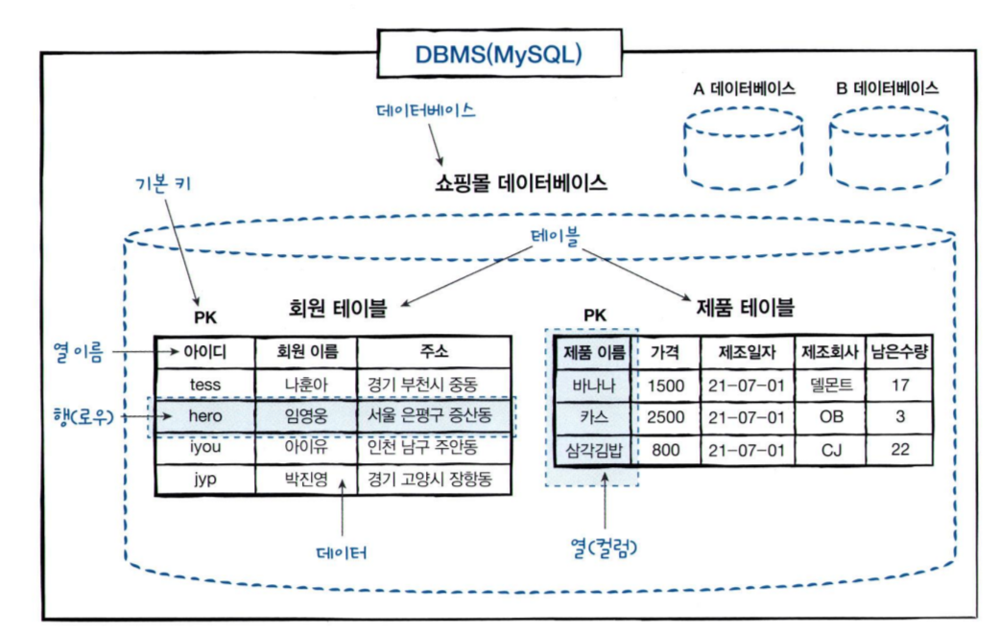
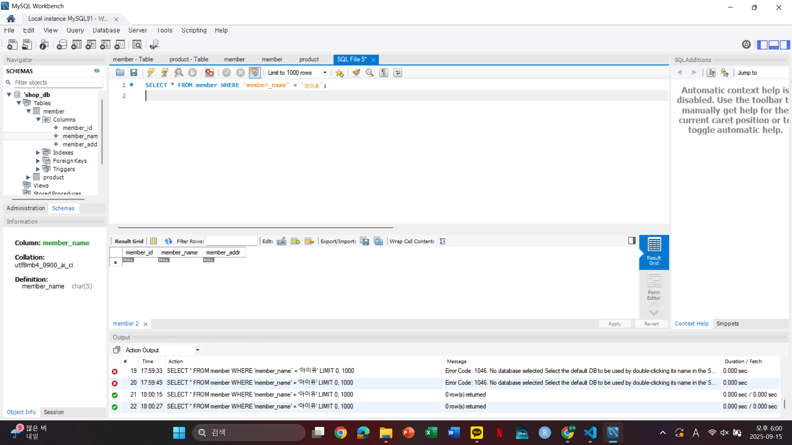

# SQL_MASTER 2주차 정규 과제 

## Week 2 : 실전용 SQL 미리 맛보기 

📌**SQL_MASTER 정규과제**는 매주 MySQL Workbench 툴을 활용하여 **직접 데이터베이스를 설계하고 실습하는 프로젝트 기반 과제**로 『*혼자 공부하는 SQL*』 책을 읽으며 학습을 진행해주시면 됩니다.

이번 주는 아래의 **SQL_MASTER_2nd_TIL**에 나열된 주제를 중심으로 개념을 학습하고, 주차별 **학습 목표**에 맞게 정리해주세요. 정리한 내용은 GitHub에 업로드한 후, **스프레드시트의 'SQL' 시트에 링크를 제출**해주세요. 


> ✅ **과제 제출 시 반드시 “Workbench 실습 화면 (캡처)” 를 첨부해주세요!**
>
> - 테이블 생성, 수정, 삭제 명령이 실행된 화면 또는 결과가 확인되는 캡처를 첨부합니다.
> - Github에 정리하는 실습 TIL 링크를 **스프레드시트 'SQL_MASTER' 시트에 제출**해주세요.


## SQL_MASTER_2nd_TIL

## 2장. 실전용 SQL 미리 맛보기

### 01. 건물을 짓기 위한 설계도 : 데이터베이스 모델링

### 02. 데이터베이스 시작부터 끝까지 

### 03. 데이터베이스 개체


## 🏁 주차별 학습 (Study Schedule)

| 주차  | 공부 범위                  | 완료 여부 |
| ----- | -------------------------- | --------- |
| 1주차 | **데이터베이스와 SQL**     | ✅         |
| 2주차 | **실전용 SQL 미리 맛보기** | ✅         |
| 3주차 | **기본, 고급 DML 복습**    | 🍽️         |
| 4주차 | **테이블과 뷰**            | 🍽️         |
| 5주차 | **인덱스**                 | 🍽️         |
| 6주차 | **스토어드 프로시져**      | 🍽️         |
| 7주차 | **SQL 파이썬 연결하기**    | 🍽️         |

<br>

<!-- 여기까진 그대로 둬 주세요-->

---

# 1️⃣ 개념정리

## 01. 실전용 SQL 미리 맛보기

~~~
✅ 학습 목표 :
* 데이터베이스 모델링의 개념을 파악할 수 있다. 
* 전반적인 데이터베이스 구축 절차를 이해할 수 있다. 
* 데이터베이스 개체인 인덱스, 뷰, 스토어드 프로시저에 대해 미리 이해할 수 있다. 
~~~

# 2-1. 건물을 짓기 위한 설계도: 데이터베이스 모델링
## 1. 프로젝트
- 현실 세계에서 일어나는 업무를 컴퓨터 시스템으로 옮겨놓는 과정  
- 대규모 소프트웨어를 작성하기 위한 전체 과정

과거에는 한두 명의 프로그래머가 작은 프로그램을 작성했지만,  
현재는 소프트웨어 규모와 기능이 커져서 체계적인 개발 절차가 필요
- 이러한 절차를 연구하는 분야가 소프트웨어 공학

## 2. 폭포수 모델
소프트웨어 공학에서 가장 기본적인 개발 절차 중 하나

각 단계가 **폭포처럼 순차적으로 진행**되기 때문에 붙여진 이름

### 폭포수 모델 단계
1. **프로젝트 계획 (Planning)**  
   - 예: 슈퍼마켓 물건을 온라인으로 판매하기 위한 계획 수립  

2. **업무 분석 (Analysis)**  
   - 현실의 슈퍼마켓 업무 파악  
   - 예: 물건 입고 경로, 계산 방식, 재고 관리 방법 등  

3. **시스템 설계 (Design)**  
   - 분석된 업무를 컴퓨터 시스템으로 옮길 수 있도록 구조화  

4. **프로그램 구현 (Implementation)**  
   - 설계 내용을 프로그래밍 언어(JS, PHP, JSP 등)로 실제 코드 작성  

5. **테스트 (Testing)**  
   - 오류 점검 및 수정  

6. **유지보수 (Maintenance)**  
   - 운영 중 발생하는 문제 보완 및 기능 추가  

### 폭포수 모델의 장단점
-  **장점**: 단계가 구분되어 있어 진행 절차가 명확 
-  **단점**: 한 번 진행된 단계를 되돌리기 어려움


## 3. 데이터베이스 모델링(Database Modeling)
### 정의
- 현실 세계의 사물이나 작업을 DBMS의 데이터베이스 개체로 옮기는 과정
- 현실의 개체를 테이블로 변환하는 작업  

- 건물에서 설계도가 중요한 것처럼, 데이터베이스 모델링은 **데이터베이스 구축을 위한 설계도** 역할

### 인터넷 쇼핑몰 예시
- **현실 세계 → 데이터베이스 테이블**로 변환
  - 사람 → `고객 테이블`, `직원 테이블`
  - 물건 → `제품 테이블`

#### 제품 테이블 속성 예시
| 속성 | 설명 |
|------|------|
| 이름 | 제품명 |
| 가격 | 판매 가격 |
| 제조일자 | 생산된 날짜 |
| 제조회사 | 제조 회사 |
| 재고량 | 남아 있는 수량 |



## 1. 데이터(Data)
- **데이터**: 단편적인 정보를 의미합니다.  
  - 예: `tess`, `아이유`, `바나나` 등


## 2. 테이블(Table)
- **테이블**: 회원이나 제품 등의 데이터를 입력하기 위해 **표 형태**로 표현한 것  
- 인터넷 쇼핑몰 예시:
  - 회원 정보를 저장하는 **회원 테이블**
  - 제품 정보를 저장하는 **제품 테이블**


## 3. 데이터베이스(Database, DB)
- **데이터베이스**: 테이블이 저장되는 저장소  
- 그림에서는 원통 모양으로 표현되며, 데이터베이스 이름은 서로 달라야 함  
- 이번 장에서 만들 데이터베이스: **쇼핑몰 데이터베이스**  
- **비유**: 데이터베이스와 테이블의 관계는 *폴더와 파일* 관계와 비슷하다.  
  - 폴더 안에 파일이 있듯, 데이터베이스 안에 테이블이 있다.


## 4. DBMS(Database Management System)
- **DBMS**: 데이터베이스 관리 시스템 또는 소프트웨어  
- 예: `MySQL`, `Oracle`, `PostgreSQL`  
- 예시: MySQL은 여러 개의 데이터베이스를 관리할 수 있음


## 5. 테이블 구조
### (1) 열(Column)
- 테이블의 세로 방향
- 각 테이블은 여러 개의 **열(컬럼, 필드)**로 구성됨
- 예시:
  - 회원 테이블 → `아이디`, `회원이름`, `주소` (3개 열)
  - 제품 테이블 → `제품명`, `가격`, `제조일자`, `제조회사`, `재고량` (5개 열)

#### 열 이름(Column Name)
- 열을 구분하기 위한 이름  
- 한 테이블 내에서는 중복 불가  
- 실제 프로젝트에서는 **영문으로 설정**하는 것이 일반적

#### 데이터 형식(Data Type)
- 열에 저장될 데이터의 형식
- 예:
  - 회원 이름 → 문자형(`VARCHAR`)  
  - 가격 → 정수형(`INT`)  


### (2) 행(Row)
- **실질적인 데이터(레코드)**  
- 예: `tess / 나훈아 / 경기 부천시 중동` → 하나의 행 데이터  
- 행의 개수 = 데이터의 개수  
  - 예: 행이 4개라면 회원이 4명 가입한 것


### (3) 기본 키(Primary Key, PK)
- 각 행을 구분하는 유일한 열  
- 예: 네이버 아이디, 학번, 주민등록번호  
- 특징:
  - 중복 불가
  - NULL(비어 있음) 불가
  - 테이블마다 **기본 키는 반드시 1개만 지정** (일반적으로 단일 열에 설정)


## 6. SQL (Structured Query Language)
- **SQL**: DBMS와 소통하기 위한 언어  
- 구조화된 질의 언어 → 데이터베이스에 명령을 전달하는 방법  
- 예: 테이블 생성, 데이터 삽입, 조회, 수정, 삭제 등을 수행  

# 2-2: 데이터베이스 시작부터 끝까지

## 1. DBMS 설치하기
- 데이터베이스를 구축하기 위해서는 **DBMS(Database Management System)**를 설치해야 함  
- 예시: MySQL, Oracle, PostgreSQL 등  
- 본 실습에서는 **MySQL**을 사용  
- 현재 DBMS 설치는 완료되었으나, 내부에 우리가 사용할 **쇼핑몰 데이터베이스**는 아직 없음


## 2. 데이터베이스 만들기
- MySQL 내부에 **비어 있는 데이터베이스**를 생성
- 예: `shop_db`라는 이름의 쇼핑몰 데이터베이스를 생성  

```sql
CREATE DATABASE shop_db;
```

## 3. 테이블 만들기
(1) 회원 테이블 (Member)

구성 열: 아이디, 회원 이름, 주소

데이터 형식: 모두 문자형(CHAR) 지정

제약 조건:

- 아이디, 회원 이름 → NOT NULL (필수 입력)

- 주소 → NULL 허용
```sql
CREATE TABLE member (
    member_id CHAR(8) NOT NULL,
    member_name CHAR(5) NOT NULL,
    member_addr CHAR(20),
    PRIMARY KEY (member_id)
);
```

(2) 제품 테이블 (Product)

구성 열: 제품 아이디, 제품 이름, 가격, 제조일자, 제조회사, 재고량

데이터 형식:

- 문자형(CHAR), 정수형(INT), 날짜형(DATE) 혼합 사용

```sql
CREATE TABLE product (
    product_id CHAR(8) NOT NULL,
    product_name CHAR(10) NOT NULL,
    price INT NOT NULL,
    manufacture_date DATE,
    company CHAR(10),
    stock INT,
    PRIMARY KEY (product_id)
);

```
## 4. 데이터 입력하기

```sql
INSERT INTO member VALUES ('tess01', 'tess', '서울시 강남구');
INSERT INTO member VALUES ('iu01', '아이유', '경기도 성남시');
INSERT INTO member VALUES ('nhn01', '나훈아', '부산시 해운대구');
INSERT INTO member VALUES ('psy01', '싸이', '서울시 서초구');

```
```sql
INSERT INTO product VALUES ('p01', '바나나', 1500, '2024-01-01', 'Dole', 100);
INSERT INTO product VALUES ('p02', '사과', 2000, '2024-02-15', '농협', 80);
INSERT INTO product VALUES ('p03', '포도', 3000, '2024-03-10', 'CJ', 50);

```
후에 데이터 활용


# 2-3: 데이터베이스 개체


# 데이터베이스 개체 (Database Objects)

테이블은 데이터베이스의 핵심 개체, 하지만
테이블 외에도 다양한 개체들이 필요

대표적인 개체:
- **인덱스**
- **뷰**
- **스토어드 프로시저**
- **트리거**: 잘못된 데이터 입력 방지
- **함수**, **커서** 


## 1. 인덱스 (Index)

### 개념
- 테이블 데이터가 많아질수록 조회 속도가 느려짐  
- 인덱스는 **조회 속도를 획기적으로 개선**하는 기능  
- 책의 '찾아보기'와 유사한 개념  

### 특징
- 테이블 전체를 처음부터 끝까지 검색하지 않고,  
  인덱스를 참조하여 원하는 데이터 위치를 빠르게 찾음  
- 소규모 데이터에서는 체감하기 어렵지만,  
  실무에서는 수천만 ~ 수억 건의 데이터에서 필수적  


## 2. 뷰 (View)

### 개념
- **가상의 테이블**  
- 실제 데이터를 저장하지 않고, **실제 테이블에 연결된 개념**  
- 사용자 입장에서는 **테이블과 동일하게 사용 가능**  
- SQL 보안 강화 및 간단한 쿼리 작성에 유용  

### 비유
- **윈도우 바로가기 아이콘**과 비슷한 개념  
  - 바로가기 아이콘 자체는 실행 파일이 아님  
  - 클릭하면 실제 실행 파일과 연결되어 실행됨  
- 뷰도 마찬가지로 **SELECT 문과 연결된 개체**  


## 3. 스토어드 프로시저 (Stored Procedure)

### 개념
- MySQL에서 제공하는 **프로그래밍 기능**  
- 여러 SQL 문을 **하나로 묶어서 실행 가능**  
- 조건문, 반복문, 연산식 등을 사용할 수 있어 **프로시저 내부 로직 구현 가능**  

### 특징
- SQL + 프로그래밍 언어적 기능 결합  
- 복잡한 작업을 반복할 때 유용  
- C, Java, Python 같은 언어보다는 제약이 있지만,  
  데이터베이스 작업 자동화에 효과적  


## 인증사진 

> **1. 책 83p의 실행결과를 올려주세요**


계속 null 나오는...ㅠ
<br>

> **2. 책 97p의 실행결과의 이미지를 올려주세요.**

<!-- 이 주석을 지우고 여기에 이미지를 첨가하세요. -->

<br>


<br>

---

# 2️⃣ 확인문제

## 문제 1

> **🧚다음 테이블을 생성하는 명령어를 실행했더니 오류가 발생했습니다. 오류의 원인이 되는 부분을 찾고, 그 이유를 설명하세요. 그리고 정상적으로 실행되기 위해 어디를 바꿔야 하는지 설명하세요.**

~~~sql
CREATE TABLE Member (
    member_id INT PRIMARY KEY,
    name VARCHAR(50),
    join_date NULL,
    email VARCHAR(100)
);
~~~


~~~
열을 정의할 때는 반드시 데이터 형식을 지정해야함

그런데 에서는 join_date에 데이터 형식 없이 NULL만 적혀 있어 문법 오류가 발생

join_date는 날짜를 저장하려는 컬럼이므로 DATE 타입을 지정
~~~
~~~sql
CREATE TABLE Member (
    member_id INT PRIMARY KEY,
    name VARCHAR(50),
    join_date DATE NULL,
    email VARCHAR(100)
);
~~~


## 문제 2

> **🧚책에서는 `DELIMTER //` 를 사용했습니다. 만약 `DELIMITER &&` 또는 `DELIMITER !!`와 같이 다른 기호를 사용해도 실행이 될까요? 만약 된다면, 그 이유도 함께 설명해주세요.**

~~~sql
DELIMITER //
CREATE PROCEDURE testProc()
BEGIN
    SELECT 'Hello, MySQL!';
END //
DELIMITER ;
~~~


~~~
가능

스토어드 프로시저를 작성할 때는 BEGIN ... END 안에도 세미콜론(;)이 들어가므로, 구문 끝을 구분하기 어려움

DELIMITER 명령을 통해 "문장의 끝 표시"를 임시로 //, &&, !!, $$ 같은 임의의 기호로 바꿔주는 것

-> DELIMITER 뒤에는 어떤 문자열이든 가능
~~~


<!-- 위의 2문제는 책 뒤 챕터에서 더 자세히 다룰 내용입니다. 첫번째 문제는 자료형에 집중해주시면 되고, 두번째 문제는 프로시저의 DELIMITER에 대해 자료를 찾아서 공부한 것들도 같이 넣어주세요. -->


# 참고자료

**MySQL Workbench 에 대한 설명이 잘 적혀있는 강의입니다. 혹시 아직 설치를 하시지 못하셨다면 아래 링크의 01, 02편 영상을 보시고 설치 진행해주시면 됩니다. 이미 들으셨던 분은 이번 주차에는 03,04 편을 시청해주시면 됩니다.**

> 책을 보고 이해가 잘 되시면 꼭 보시지는 않으셔도 됩니다.


[참고 외부자료는 여기를 클릭해주세요.](https://www.youtube.com/playlist?list=PL_RECGqDS3ieZFybjCx0kTYkPK-TioY1S)

<br>

### 🎉 수고하셨습니다.
