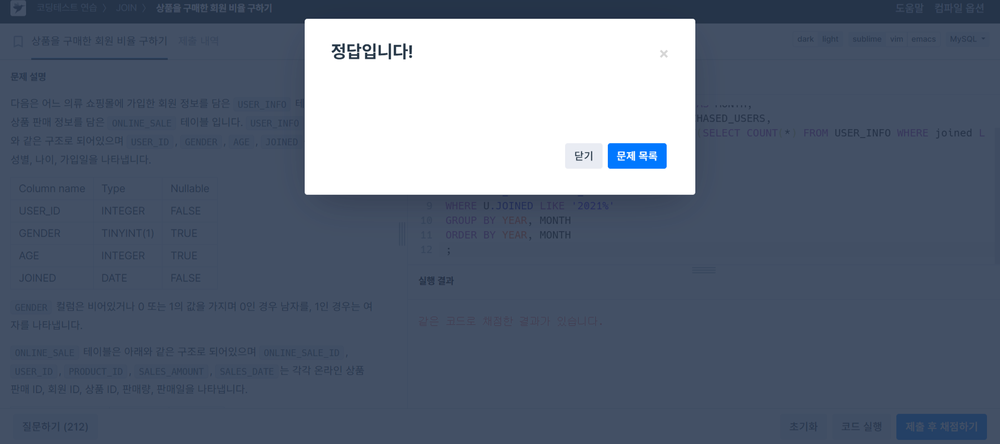

# SQL_MASTER 3주차 정규 과제 

## Week 3 : SQL 기본 문법

📌**SQL_MASTER 정규과제**는 매주 MySQL Workbench 툴을 활용하여 **직접 데이터베이스를 설계하고 실습하는 프로젝트 기반 과제**입니다. 

이번 주는 아래의 **SQL_MASTER_3rd_TIL**에 나열된 주제를 중심으로 개념을 학습하고, 주차별 **학습 목표**에 맞게 정리해주세요. 정리한 내용은 GitHub에 업로드한 후, **스프레드시트의 'SQL' 시트에 링크를 제출**해주세요. 


> ✅ **과제 제출 시 반드시 “Workbench 실습 화면 (캡처)” 를 첨부해주세요!**
>
> - 테이블 생성, 수정, 삭제 명령이 실행된 화면 또는 결과가 확인되는 캡처를 첨부합니다.
> - Github에 정리하는 실습 TIL 링크를 **스프레드시트 'SQL_MASTER' 시트에 제출**해주세요.


<!-- 이번 주차는 SELECT 구문에 대한 복습입니다. 개념 정리는 책을 읽으면서 평소 잘 못 알고 있거나 헷갈리는 개념을 위주로 정리해주세요. -->

> **이번 주차는 SELECT 구문의 복습으로 프로그래머스에서 한 문제를 풀어야합니다. 문제를 풀고, 정답 인증을 해주세요**


## SQL_MASTER_3rd_TIL

## 3장. SQL 기본 문법

### 01. 기본 중에 기본 SELECT ~FROM ~WHERE

### 02. 좀 더 깊게 알아보는 SELECT 문

### 03. 데이터 변경을 위한 SQL 문


## 4장. SQL 고급 문법

### 01. MySQL의 데이터 형식 

### 02. 두 테이블을 묶는 조인

### 03. SQL 프로그래밍


## 🏁 주차별 학습 (Study Schedule)

| 주차  | 공부 범위                  | 완료 여부 |
| ----- | -------------------------- | --------- |
| 1주차 | **데이터베이스와 SQL**     | ✅         |
| 2주차 | **실전용 SQL 미리 맛보기** | ✅         |
| 3주차 | **기본, 고급 DML 복습**    | ✅         |
| 4주차 | **테이블과 뷰**            | 🍽️         |
| 5주차 | **인덱스**                 | 🍽️         |
| 6주차 | **스토어드 프로시져**      | 🍽️         |
| 7주차 | **SQL 파이썬 연결하기**    | 🍽️         |

<br>

<!-- 여기까진 그대로 둬 주세요-->

---

# 1️⃣ 개념정리

## 01. SQL 기본 문법

~~~
✅ 학습 목표 :
* 테이블에서 데이터를 추출하는 SELECT 문을 완벽히 이해할 수 있다.
* 여러 건의 데이터를 그룹으로 묶는 방법을 능숙하게 사용할 수 있다.
* 데이터를 입력, 수정, 삭제 하는 방법을 익히고 활용할 수 있다. 
~~~

<!-- 새롭게 배운 내용을 자유롭게 정리해주세요.-->

## 1. SELECT 문
- **SELECT** 문은 구축된 테이블에서 데이터를 추출하는 기능
- 아무리 많이 사용해도 기존 데이터는 변경되지 않음

**기본 형식**
```sql
SELECT 열_이름
FROM 테이블_이름
WHERE 조건식;
````

* `SELECT`: 추출할 열(Column) 지정
* `FROM`: 데이터를 가져올 테이블 이름 지정
* `WHERE`: 조건식 지정 → 원하는 데이터만 조회 가능


## 2. 데이터베이스 만들기

```sql
DROP DATABASE IF EXISTS market_db;
CREATE DATABASE market_db;
```

* `DROP DATABASE`: 기존의 데이터베이스 `market_db` 삭제
* `CREATE DATABASE`: 새로운 `market_db` 생성


## 3. USE 문

* 현재 사용할 데이터베이스 지정/변경
* MySQL Workbench에서 `SCHEMAS` 패널에서 더블 클릭하는 것과 동일한 효과

```sql
USE market_db;
```


## 4. 테이블 만들기

* `member` 테이블 생성 예시
* 열 이름은 영문으로, 주석으로 한글 설명 표기
* `VARCHAR`는 문자 데이터 타입 (CHAR와 유사)


## 5. 데이터 입력하기

데이터는 `INSERT` 문으로 입력

* 문자형(`CHAR`, `VARCHAR`, `DATE`) → 작은따옴표(`'`) 사용
* 숫자형(`INT`) → 작은따옴표 없이 입력


```sql
INSERT INTO member VALUES ('M001', '아이유', '서울', 162);
```

* `buy` 테이블의 첫 번째 열(순번, num)은 자동 증가 컬럼
  → 값 대신 `NULL` 입력 시 자동으로 1, 2, 3… 증가


## 6. 데이터 조회하기

```sql
SELECT * FROM member;
SELECT * FROM buy;
```

* `*` : 모든 열(Column)을 의미
* 행(Row) 전체를 조회


## 7. SELECT 문 상세 구조

```sql
SELECT 열이름
FROM 테이블 이름
WHERE 조건식
GROUP BY 열 이름
HAVING 조건식
ORDER BY 열 이름
LIMIT 숫자;
```

* `WHERE`: 조건 지정
* `GROUP BY`: 그룹화
* `HAVING`: 그룹 조건
* `ORDER BY`: 정렬
* `LIMIT`: 출력 건수 제한


## 8. 기본 조회하기

### 모든 열 조회

```sql
SELECT * FROM member;
```

### 특정 열만 조회

```sql
SELECT mem_name FROM member;
```


## 9. WHERE 조건으로 특정 데이터 조회

### 특정 회원 조회

```sql
SELECT * FROM member
WHERE mem_name = '블랙핑크';
```

* 문자형 조건 값은 `'작은따옴표'`로 묶음

### 관계 연산자 사용

```sql
SELECT mem_id, mem_name
FROM member
WHERE height <= 162;
```

### 논리 연산자 사용

```sql
SELECT mem_name, height, mem_number
FROM member
WHERE height >= 165 AND mem_number > 6;
```

* `AND`: 두 조건 모두 만족
* `OR`: 두 조건 중 하나만 만족

### 범위 검색

```sql
SELECT mem_name, addr
FROM member
WHERE addr IN ('경기', '전남', '경남');
```

### 패턴 검색

```sql
SELECT mem_name
FROM member
WHERE mem_name LIKE '우%';
```

* `%` : 임의의 문자열 의미 (예: "우"로 시작하는 모든 이름)


## 10. 서브쿼리 (Subquery)

* `SELECT` 문 안에 또 다른 `SELECT` 문을 포함 가능
* 장점: 2개의 SQL을 하나로 합쳐 관리가 간단해짐


## 02. SQL 고급 문법

~~~
✅ 학습 목표 :
* 다양한 데이터 형식에 대해 이해할 수 있다.
* 두 테이블을 연결하는 조인을 이해하고 활용할 수 있다.
* SQL에서 일반 프로그래밍 기능을 구현할 수 있다. 
~~~

<!-- 새롭게 배운 내용을 자유롭게 정리해주세요.-->


## 1. ORDER BY 
- 결과의 순서를 조절하는 구문
- 데이터 값 자체에는 영향을 주지 않음
- 기본값은 오름차순(ASC), 내림차순은 DESC

```sql
SELECT mem_id, mem_name, debut_date, height
FROM member
WHERE height >= 164
ORDER BY height DESC;
````

### 다중 기준 정렬

* 여러 열을 기준으로 순서를 지정할 수 있음
* 첫 번째 열로 정렬 후 값이 같으면 두 번째 열로 정렬

```sql
SELECT mem_name, height, debut_date
FROM member
ORDER BY height DESC, debut_date ASC;
```

## 2. LIMIT

* 출력 결과의 개수를 제한하는 구문
* 기본 형식: `LIMIT 시작, 개수`

```sql
-- 앞에서 3건만 출력
SELECT * 
FROM member 
LIMIT 3;

-- 키 기준 내림차순 정렬 후, 3번째부터 2건만 출력
SELECT mem_name, height
FROM member
ORDER BY height DESC
LIMIT 3, 2;
```

## 3. 집계 함수 

* 그룹화된 데이터에 대해 합계, 평균, 최소/최대, 개수를 계산

| 함수                | 설명         |
| ----------------- | ---------- |
| `SUM()`           | 합계         |
| `AVG()`           | 평균         |
| `MIN()`           | 최소값        |
| `MAX()`           | 최대값        |
| `COUNT()`         | 행의 개수      |
| `COUNT(DISTINCT)` | 중복 제거 후 개수 |

## 4. DISTINCT

- 조회된 결과에서 중복된 데이터 제거

```sql
SELECT DISTINCT addr 
FROM member;
```


## 5. GROUP BY

- 지정한 열의 동일한 값끼리 묶음
- 주로 집계 함수와 함께 사용

```sql
SELECT mem_id, SUM(amount) AS total_amount
FROM buy
GROUP BY mem_id;
```

---

## 6. HAVING 

- `GROUP BY`와 함께 사용
- `WHERE`와 비슷하지만 집계 함수 조건에 사용됨
- 반드시 `GROUP BY` 뒤에 위치해야 함

```sql
SELECT mem_id AS "회원 아이디", SUM(price*amount) AS "총 구매 금액"
FROM buy
GROUP BY mem_id
HAVING SUM(price*amount) > 1000;
```


<br>

---

# 2️⃣ 확인문제

## 문제 1

> **🧚다음 쿼리는 조건에 따라 다른 결과를 출력하는 구문입니다. 아래 빈칸에 들어갈 적절한 SQL 키워드를 채우세요.**

~~~sql
SELECT member_id, name,
       ( ______
           ______ join_date IS NULL ______ '미가입',
           ______ join_date IS NOT NULL ______ '가입완료'
       ______ ) AS join_status
FROM Member
______ name;
~~~

> **또한, 이 쿼리는 무엇을 하기 위해 작성된 것인지도 간단히 작성해주시면 됩니다.**


~~~sql
SELECT member_id, name,
    (CASE 
        WHEN join_date IS NULL THEN '미가입'
        WHEN join_date IS NOT NULL THEN '가입완료'
    END) AS join_status
FROM Member
ORDER BY name;
~~~
회원 테이블에서 회원들의 가입 여부를 보기 위한 쿼리


---

# 3️⃣ 실습 문제

https://school.programmers.co.kr/learn/courses/30/lessons/131534

> 프로그래머스 : 상품을 구매한 회원 비율 구하기 (Lv 5)

~~~sql
SELECT DATE_FORMAT(O.SALES_DATE, '%Y') AS YEAR,
        DATE_FORMAT(O.SALES_DATE, '%m') AS MONTH,
        COUNT(DISTINCT U.USER_ID) AS PUCHASED_USERS,
        ROUND(COUNT(DISTINCT U.USER_ID)/(SELECT COUNT(*) FROM USER_INFO WHERE joined LIKE '2021%'), 1) AS PUCHASED_RATIO
FROM USER_INFO U
JOIN ONLINE_SALE O
ON U.USER_ID = O.USER_ID
WHERE U.JOINED LIKE '2021%'
GROUP BY YEAR, MONTH
ORDER BY YEAR, MONTH
;
~~~
~~~
DATE_FORMAT(O.SALES_DATE, '%Y') → 판매 일자에서 연도 추출

DATE_FORMAT(O.SALES_DATE, '%m') → 판매 일자에서 월 추출

COUNT(DISTINCT U.USER_ID) → 해당 연/월에 구매한 고유 사용자 수

(SELECT COUNT(*) FROM USER_INFO WHERE joined LIKE '2021%')
→ 2021년에 가입한 전체 사용자 수

ROUND(..., 1) → 구매자 비율을 소수점 첫째 자리까지 반올림

GROUP BY YEAR, MONTH → 연도별, 월별로 집계

ORDER BY YEAR, MONTH → 연/월 순서대로 정렬
~~~


# 참고자료

**이번 주차에서는 강의에서 05, 06, 07편을 보면서 관계를 연결하는 방법을 워크벤치에서는 어떻게 하는지 미리 예습하는 느낌으로 시청해주시면 됩니다.**


[참고 외부자료는 여기를 클릭해주세요.](https://www.youtube.com/playlist?list=PL_RECGqDS3ieZFybjCx0kTYkPK-TioY1S)

<br>

### 🎉 수고하셨습니다.
